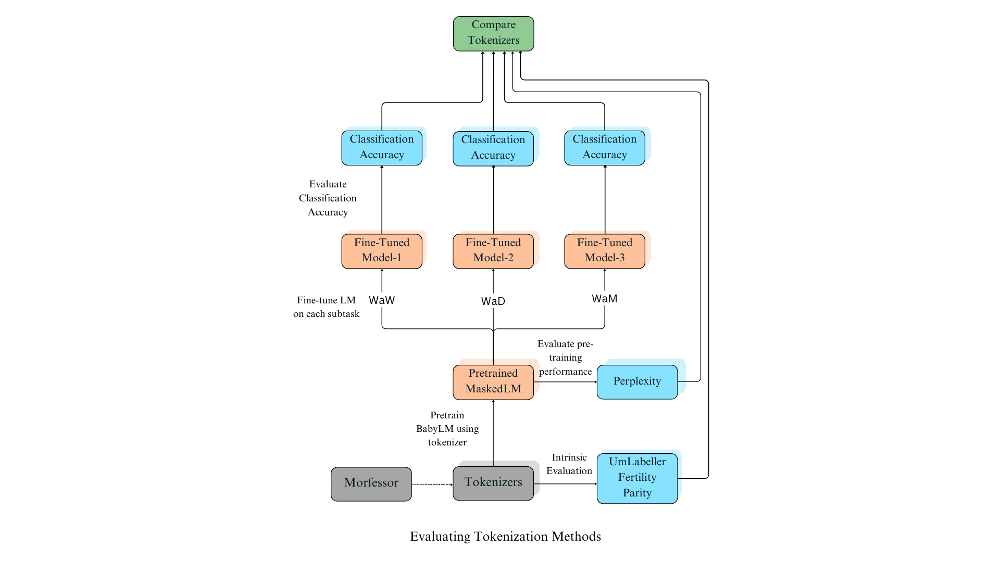

<h2 align="center"><b><h3>LTG-BERT-BABYLM: Pretraining and Fine Tuning</h3><h3>Evaluating Tokenization Methods</h3></b></h2><br>

<p align="center">
  <a href="https://github.com/ltgoslo/ltg-bert/tree/main"><b>Original Repository</b></a><br>
  <a href="https://arxiv.org/abs/2303.09859"><b>Paper</b></a><br>
  <a href="https://huggingface.co/ltg/bnc-bert-span"><b>HuggingFace models</b></a>
</p>

<!--
<p align="center">
    
</p>
-->
_______

<br>

This is the adapted version of the official repository for EACL paper about pre-training language models on a representative 100M-word corpus. Proposed model has data-efficient LM architecture (LTG-BERT) that outperforms the original BERT model. These scripts are used for evaluating different tokenizer on langauge modeling.

_______

<br>

## Workflow


## Content of this repository

- `./train/model.py`: HuggingFace-compatible wrapper for LTG-BERT
- `./train/train.py`: Script for training LTG-BERT on processed dataset
- `./preprocessing/`: Scripts for processing the XML format of BNC and for processing the evaluation datasets (not needed for normal text corpus)
- `./evaluation/`: Evaluation scripts for evaluation LTG-BERT on (Super)GLUE, edge probing and BLiMP
- `./fine_tuning/`: Scripts for fine tuning pretrained ltg-bert-babylm models for Sequence Classification task.
- `./tokenizers/`: Pretrained tokenizers
- `./create_tokenizers/`: Scripts for training tokenizers given text corpus
- `./sbatch_scripts/`: Scripts for running batch jobs in SLURM environments (ADA)
- `./data/`: Contains preprocessed datasets for pretraining
- `./configs/`: Configuration of the model before pretraining
- `./checkpoints/`: Saved pretrained models
- `./results/`: Contains evaluation results and pretraining results

_______

<br>

## Credits
```bibtex
@inproceedings{samuel-etal-2023-trained,
    title = "Trained on 100 million words and still in shape: {BERT} meets {B}ritish {N}ational {C}orpus",
    author = "Samuel, David  and
      Kutuzov, Andrey  and
      {\O}vrelid, Lilja  and
      Velldal, Erik",
    booktitle = "Findings of the Association for Computational Linguistics: EACL 2023",
    month = may,
    year = "2023",
    address = "Dubrovnik, Croatia",
    publisher = "Association for Computational Linguistics",
    url = "https://aclanthology.org/2023.findings-eacl.146",
    pages = "1954--1974",
    abstract = "While modern masked language models (LMs) are trained on ever larger corpora, we here explore the effects of down-scaling training to a modestly-sized but representative, well-balanced, and publicly available English text source {--} the British National Corpus. We show that pre-training on this carefully curated corpus can reach better performance than the original BERT model. We argue that this type of corpora has great potential as a language modeling benchmark. To showcase this potential, we present fair, reproducible and data-efficient comparative studies of LMs, in which we evaluate several training objectives and model architectures and replicate previous empirical results in a systematic way. We propose an optimized LM architecture called LTG-BERT.",
}
```

### Requirements
Ensure the following packages are installed
```
absl-py==2.1.0
accelerate==1.0.1
aiohappyeyeballs==2.4.2
aiohttp==3.10.8
aiosignal==1.3.1
antlr4-python3-runtime==4.9.3
async-timeout==4.0.3
attrs==24.2.0
certifi==2024.7.4
charset-normalizer==3.3.2
click==8.1.7
contourpy==1.3.0
cycler==0.12.1
datasets==3.0.1
dill==0.3.8
docker-pycreds==0.4.0
filelock==3.15.4
fonttools==4.54.1
frozenlist==1.4.1
fsspec==2024.6.1
fvcore==0.1.5.post20221221
gitdb==4.0.11
GitPython==3.1.43
huggingface-hub==0.24.5
idna==3.7
iopath==0.1.10
Jinja2==3.1.3
joblib==1.4.2
kiwisolver==1.4.7
lightning-utilities==0.11.7
MarkupSafe==2.1.5
matplotlib==3.9.2
mpmath==1.3.0
multidict==6.1.0
multiprocess==0.70.16
networkx==3.2.1
nltk==3.8.1
numpy==1.26.3
nvidia-cublas-cu11==11.11.3.6
nvidia-cuda-cupti-cu11==11.8.87
nvidia-cuda-nvrtc-cu11==11.8.89
nvidia-cuda-runtime-cu11==11.8.89
nvidia-cudnn-cu11==9.1.0.70
nvidia-cufft-cu11==10.9.0.58
nvidia-curand-cu11==10.3.0.86
nvidia-cusolver-cu11==11.4.1.48
nvidia-cusparse-cu11==11.7.5.86
nvidia-nccl-cu11==2.20.5
nvidia-nvtx-cu11==11.8.86
omegaconf==2.3.0
packaging==24.1
pandas==2.2.3
peft==0.13.2
pillow==10.2.0
platformdirs==4.2.2
portalocker==2.10.1
protobuf==5.27.3
psutil==6.0.0
pyarrow==17.0.0
pyparsing==3.2.0
python-dateutil==2.9.0.post0
pytz==2024.2
PyYAML==6.0.2
regex==2024.7.24
requests==2.32.3
rouge_score==0.1.2
sacremoses==0.1.1
safetensors==0.4.5
scikit-learn==1.5.2
scipy==1.14.1
seaborn==0.13.2
sentry-sdk==2.13.0
setproctitle==1.3.3
six==1.16.0
smart-open==7.0.4
smmap==5.0.1
sympy==1.12
tabulate==0.9.0
termcolor==2.5.0
threadpoolctl==3.5.0
tokenizers==0.19.1
torch==2.4.0+cu118
torchaudio==2.4.0+cu118
torchmetrics==1.4.2
torchtext==0.18.0
torchvision==0.19.0+cu118
tqdm==4.66.5
transformers==4.44.2
triton==3.0.0
typing_extensions==4.12.2
tzdata==2024.2
urllib3==2.2.2
wandb==0.17.7
wrapt==1.16.0
xxhash==3.5.0
yacs==0.1.8
yarl==1.13.1
```